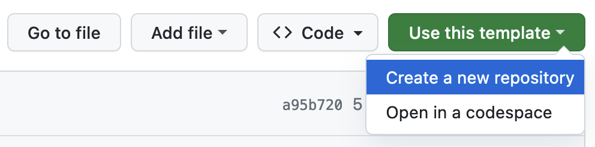

# RADAR-K8s-Infrastructure

This repository aims to provide [IaC](https://en.wikipedia.org/wiki/Infrastructure_as_code) templates for [RADAR-Kubernetes](https://github.com/RADAR-base/RADAR-Kubernetes) users who intend to deploy the platform to Kubernetes clusters supported by cloud providers such as [AWS](https://aws.amazon.com/eks/).

---

[](https://github.com/phidatalab/RADAR-K8s-Infrastructure/actions/workflows/pre-commit.yaml/badge.svg)
[](https://docs.google.com/forms/d/e/1FAIpQLScKNZ-QonmxNkekDMLLbP-b_IrNHyDRuQValBy1BAsLOjEFpg/viewform)

<!-- START doctoc generated TOC please keep comment here to allow auto update -->
<!-- DON'T EDIT THIS SECTION, INSTEAD RE-RUN doctoc TO UPDATE -->

- [Dependencies](#dependencies)
- [Usage](#usage)
  - [Workspaces](#workspaces)
  - [Configure credentials](#configure-credentials)
  - [Create the infrastructure](#create-the-infrastructure)
  - [Connect to and verify the cluster](#connect-to-and-verify-the-cluster)
  - [Configure the cluster (optional)](#configure-the-cluster-optional)
  - [Contributing](#contributing)
  - [Known limitations](#known-limitations)

<!-- END doctoc generated TOC please keep comment here to allow auto update -->

# Dependencies

[Terraform](https://developer.hashicorp.com/terraform/downloads) >= 1.9.0<br>
[AWS CLI](https://docs.aws.amazon.com/cli/latest/userguide/getting-started-install.html) >= 2.11

# Usage

It is recommended that you use RADAR-K8s-Infrastructure as a template and create your own IaC repository from it (starting with a private one probably). Make sure to customise enclosed templates to your needs before creating the desired infrastructure.



## Workspaces

The definition of resources required for running RADAR-base components is located in the `cluster` directory, while other optional resources are defined in the `config` directory. Please treat each directory as a separate workspace and perform terraform operations individually. The `cluster` resources need to be created and made fully available before you proceed with the creation of the `config` ones.

To retain the user-specific configurations for future infrastructure updates, modify `terraform.tfvars` within the workspace and push the change to your repository. If needed, additional variables defined in `variables.tf` can also be included there.
| :information_source: Important Notice |
|:----------------------------------------|
|As a best practice, never save raw values of secret variables in your repository. Instead, always encrypt them before committing. If your cluster is no longer in use, run `terraform destroy` to delete all the associated resources and reduce your cloud spending. If you have resources created within `config`, run `terraform destroy` in that directory before running the counterpart in `cluster`.|

## Configure credentials

```
export TF_VAR_AWS_REGION=$AWS_REGION
export TF_VAR_AWS_ACCESS_KEY_ID=$AWS_ACCESS_KEY_ID
export TF_VAR_AWS_SECRET_ACCESS_KEY=$AWS_SECRET_ACCESS_KEY
# For temporary credentials and SSO
export TF_VAR_AWS_SESSION_TOKEN=$AWS_SESSION_TOKEN
```

## Create the infrastructure

```
cd cluster
```

```
# Initialise the working directory

terraform init
```

```
# Review the changes going to be made

terraform plan
```

```
# Create/update the infrastructure

terraform apply --auto-approve
```

Created resources:

- VPC featuring both public and private subnets
- VPC endpoints for privately accessing AWS services
- Internet and NAT gateways
- EKS cluster with a default worker node group
- EKS coredns, kube-proxy, vpc-cni and aws-ebs-csi-driver addons
- EBS storage classes referenced by PVCs
- IRSAs for VPC CNI and EBS CSI controllers
- Initial EC2 instances launched with Spot capacity
- Default network ACLs and route tables
- KMS keys and CloudWatch log groups
- Essential IAM policies, roles, users and user groups for accessing aforementioned resources

## Connect to and verify the cluster

```
# Make sure to use --region if the cluster is deployed in non-default region and --profile if the cluster is deployed in a non-default AWS account
aws eks update-kubeconfig --name `terraform output eks_cluster_name` --alias `terraform output eks_cluster_name` --role-arn `terraform output assume_eks_admins_role`
kubectl get nodes
kubectl get pods -A
```

Once the infrastructure update is finished successfully, you can start deploying RADAR-base components to the newly created cluster by following the [Installation Guide](https://github.com/RADAR-base/RADAR-Kubernetes#installation). Before running `helmfile sync`, you will find it necessary to configure certain resource values which are required by `production.yaml` but only known post to infrastructure creation. We have exported the values of those resources and you can get them by simply running:

```
terraform output
```

Note that output values can be crucial for configuring certain RADAR-base components prior to deployment. For instance, if you are using the nginx-ingress controller with NLB, specify the subnet(s) and the EIP allocation ID as follows:

```yaml
nginx_ingress:
    _install: true
    controller:
        ...
        service:
            annotations:
                service.beta.kubernetes.io/aws-load-balancer-type: nlb
                service.beta.kubernetes.io/aws-load-balancer-subnets: <radar_base_vpc_public_subnets[0]>
                service.beta.kubernetes.io/aws-load-balancer-eip-allocations: <radar_base_eip_allocation_id>
```

You could also automate this value injection by implementing your own templating strategy to customise `production.yaml`.

## Configure the cluster (optional)

N.B.: To get external DNS, Cert Manager and SMTP working via Route 53 (if chosen as your DNS service), you need to configure your registered top-level domain and its corresponding hosted zone ID via variable `domain_name` in [config/terraform.tfvars](./config/terraform.tfvars). Additionally, set `enable_route53` to `true`.

```
cd config
terraform init
terraform plan
terraform apply --auto-approve
```

Optional resource creations are disabled by default. To enable the creation of a specific resource named `X`, navigate to [config/terraform.tfvars](./config/terraform.tfvars) and update the value of `enable_X` to `true` before applying the template.

Created resources (if all enabled):

- EIP allocated for the load balancer created by Ingress-NGINX
- Karpenter provisioner, the node template and the SQS interruption queue
- Metrics Server along with the Kubernetes Dashboard and the read-only user
- MSK cluster featuring Kafka brokers and zookeepers
- RDS instance running managementportal, appserver and rest_sources_auth databases
- Route53 zone and records accompanied by IRSAs for external DNS and Cert Manager
- S3 buckets for intermediate-output-storage, output-storage and velero-backups
- SES SMTP endpoint
- CloudWatch event rules and targets
- Essential IAM policies, roles, users for aforementioned resources

## Contributing

The dependencies and linting tools and managed via Devbox, you need to [install it](https://jetify-com.vercel.app/docs/devbox/installing_devbox/#install-devbox) before proceeding. Once that is done you can run

```
devbox shell
```

To download all of the dependencies and install to Git hooks to lint the configuration before it is committed.

In order to support new version of EKS you need to make sure the addons that we use are compatible with the new target version. You can get a list of addons and their EKS compatibility with running `aws eks describe-addons-versions` and then searching for the addons that are defined in [cluster/data.tf](./cluster/data.tf).

This project also uses [Conventional Commits](https://www.conventionalcommits.org/en/v1.0.0/) to have a standardized commit message. Please have a look and make sure your commit message follows that.

## Known limitations

- Since EBS has been chosen as the default storage, node groups will be created in a single AZ due to the mounting restriction.
- Sometimes Terraform tries to replace the existing MSK cluster while re-applying the templates even if there is no change on the cluster. Mitigate this with `terraform untaint aws_msk_cluster.msk_cluster`.
- Prior to `terraform destroy`, infrastructure resources created by pods/controllers and may not be visible to Terraform need to be deleted, e.g., nginx-ingress's NLB. A good practice is to always begin by running `helmfile destroy`.
- If Karpenter is used for node provisioning, ensure the nodes created by it are not lingering around before running `terraform destroy`.
